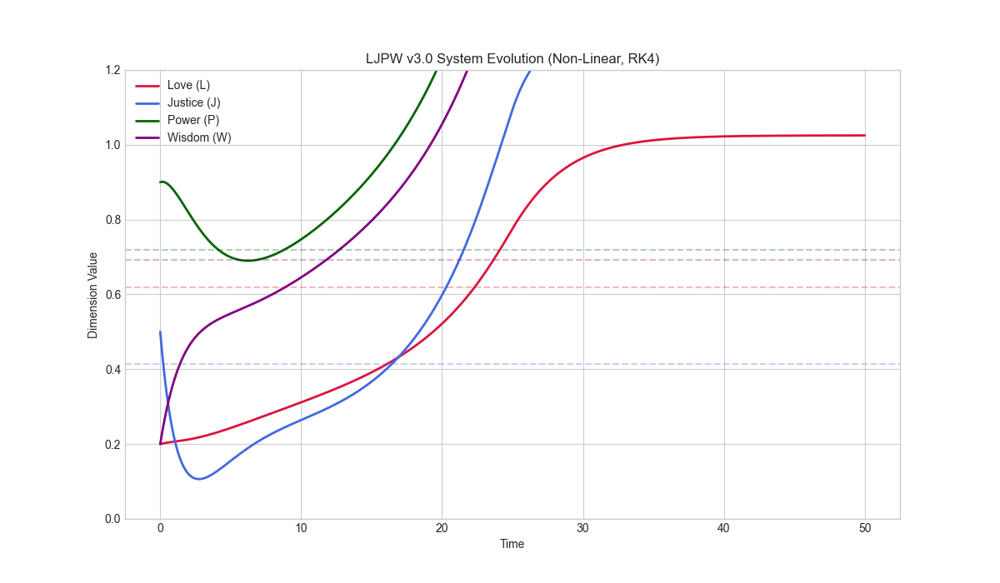

# Python Code Harmonizer (LJPW v4.0)

**The Physics of Software Quality.**

The Python Code Harmonizer is a next-generation static analysis and visualization tool that evaluates codebases using the **LJPW v4.0 Framework** (Love, Justice, Power, Wisdom). It treats code as a dynamic system, using non-linear physics models to predict technical debt, identify architectural smells, and guide refactoring.



## 🌐 Try It in Your Browser!

**No installation needed!** Use our standalone web app:

👉 **[Download harmonizer.html](harmonizer.html)** and open it in any browser

**Features:**
- ✨ Zero setup - just download and open
- 🔒 100% private - all analysis happens in your browser
- 📱 Works offline after first load
- 🎯 Beautiful visualizations with LJPW radar charts
- 🚀 Drag-and-drop Python files or paste code
- 💾 Free forever (MIT License)

**Perfect for:**
- Quick code reviews
- Learning semantic analysis
- Teaching code quality
- Personal development

[**📖 Web App Usage Guide**](docs/WEB_APP_USAGE.md)

---

## Key Features

### 1. 🌌 Dynamic Physics Model (LJPW v4.0)
Unlike traditional linters that count errors, the Harmonizer simulates your code's "energy state" over time.
-   **Natural Equilibrium (NE)**: Stable state for healthy code (`L=0.62, J=0.41, P=0.72, W=0.69`).
-   **High-Energy State**: "Thriving" state for complex, well-architected systems.
-   **Entropy Detection**: Predicts "Justice Collapse" (technical debt avalanches) before they happen.

### 2. 📊 Visual Analytics
Generate interactive HTML reports to explore your codebase's semantic structure.
-   **Radar Charts**: Visualize the balance of Love (Care), Justice (Structure), Power (Action), and Wisdom (Abstraction).
-   **Dependency Galaxy**: A force-directed graph showing the "gravitational pull" of your modules.
-   **Semantic Density**: Identify "Anemic Components" (high complexity, low action).

### 3. 🛡️ CI/CD Integration
Prevent entropy decay with built-in quality gates.
-   **`check_harmony.py`**: CLI tool for CI pipelines. Fails builds if code drifts too far from equilibrium.
-   **GitHub Action**: Ready-to-use workflow in `.github/workflows/ljpw_gate.yml`.
-   **Pre-commit Hook**: Local checks via `.pre-commit-config.yaml`.

### 4. 🔬 Relationship Analysis
Validate that your system exhibits healthy LJPW coupling patterns.
-   **Pattern Validation**: Check if Love amplifies, Power is constrained
-   **Proportion Analysis**: Verify scale-invariant ratios
-   **Structural Health**: Diagnose relationship issues vs. magnitude issues

```python
from harmonizer.relationship_analyzer import analyze_system_relationships

result = analyze_system_relationships(L=0.5, J=0.3, P=0.7, W=0.6)
print(f"Health: {result['overall_health']:.0%}")
# Provides actionable recommendations
```

### 5. ⚙️ Developer Experience
-   **Configurable**: Customize thresholds in `pyproject.toml` or `harmonizer.yaml`.
-   **Ignore System**: Exclude files using `.harmonizerignore`.

## Installation

### Option 1: Web App (Recommended for Quick Use)
No installation needed! Download `harmonizer.html` and open in your browser.

### Option 2: CLI Tool (For CI/CD and Advanced Use)
```bash
pip install -r requirements.txt
```

## Usage

### Web App Usage
1. Download `harmonizer.html`
2. Open in any modern browser
3. Paste Python code or drag-and-drop files
4. View instant analysis with visualizations

See [Web App Usage Guide](docs/WEB_APP_USAGE.md) for details.

### CLI Tool Usage

### 1. Generate Visual Report
Analyze your codebase and generate an interactive HTML dashboard:

```bash
python scripts/run_validation.py
# Opens harmonizer_report.html
```

### 2. Run Quality Gate (CI/CD)
Check if your code meets LJPW standards (exit code 0 = PASS, 1 = FAIL):

```bash
python check_harmony.py .
```

### 3. Configuration
Create a `pyproject.toml` to customize thresholds:

```toml
[tool.harmonizer.thresholds]
max_disharmony = 1.0
max_imbalance = 0.8
min_density = 0.1

[tool.harmonizer.paths]
exclude = ["venv", "tests"]
```

## The LJPW Framework

### The Four Dimensions

-   **Love (L)**: Care, readability, comments, user-focus.
-   **Justice (J)**: Structure, types, tests, consistency.
-   **Power (P)**: Action, logic, complexity, performance.
-   **Wisdom (W)**: Abstraction, architecture, patterns, insight.

### Scale Invariance & Relationship Structure

**Key Insight**: *The relationships between dimensions are more important than their absolute values.*

The LJPW Framework exhibits **scale invariance** - the same proportional relationships (L:J:P:W ≈ 1.5:1:1.7:1.7) define healthy systems at any scale:

-   **Small team**: (6, 4, 7, 7) developers
-   **Medium project**: (62, 41, 72, 69) metrics
-   **Large organization**: (618, 414, 718, 693) person-hours

**Coupling Structure** encodes how dimensions interact:
-   **Love amplifies** other dimensions (multiplier effect)
-   **Power must be constrained** (channeled through Love/Wisdom)
-   **Justice supports Wisdom** (truth-seeking flows to understanding)
-   **Asymmetry is fundamental** (giving ≠ receiving)

This structural universality makes the framework applicable across domains: code quality, team dynamics, organizational health, and ecosystems.

**Learn more**: See [Relationship Insight Analysis](RELATIONSHIP_INSIGHT_SYNTHESIS.md)

## Project Structure

-   `harmonizer/`: Core analysis engine.
-   `scripts/`: Utility scripts (`run_validation.py`).
-   `docs/`: Detailed documentation and theory.
-   `examples/`: Demo scripts.
-   `tests/`: Unit and validation tests.

## License
MIT
